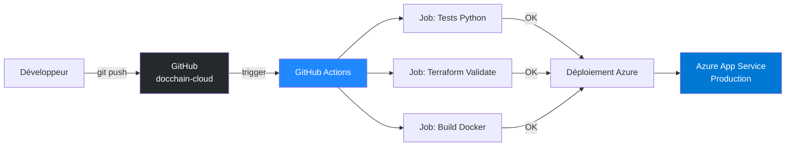
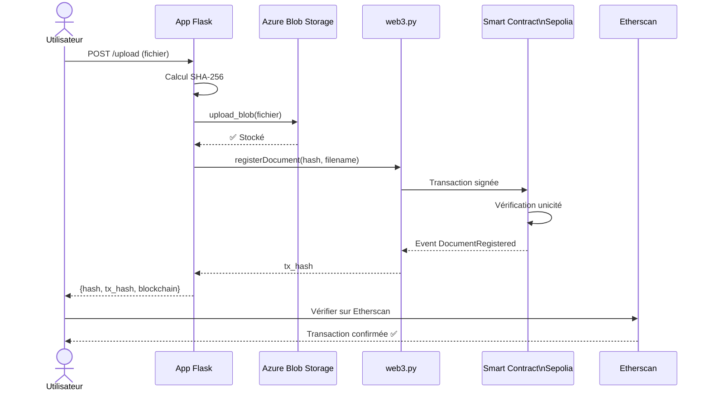
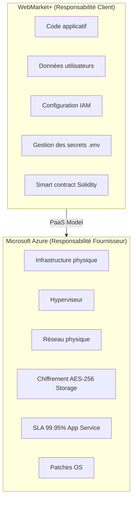

# Schémas d'architecture DocChain

## 1. Architecture Cloud Globale (C21)

```mermaid
graph TB
    User[Utilisateur] -->|HTTPS| App[Azure App Service\ndocchain-sina-efrei]
    App -->|azure-storage-blob SDK| Storage[Azure Blob Storage\ndocchainsinara]
    App -->|web3.py| Blockchain[Ethereum Sepolia\nSmart Contract]
    App -->|prometheus_client| Metrics[/metrics endpoint]
    Metrics -->|scrape 1min| Grafana[Grafana Cloud\ndocchain.grafana.net]
    Grafana -->|alerte webhook| App
    Storage -->|chiffrement AES-256| Data[(Fichiers stockés)]
    KV[Azure Key Vault\ndocchain-kv-sina] -->|secrets| App
    Terraform[Terraform IaC] -->|provision| App
    Terraform -->|provision| Storage
    Terraform -->|provision| KV
    style App fill:#0078D4,color:#fff
    style Storage fill:#0078D4,color:#fff
    style KV fill:#0078D4,color:#fff
    style Blockchain fill:#627EEA,color:#fff
    style Grafana fill:#F46800,color:#fff
```

## 2. Pipeline CI/CD (C22)



## 3. Séquence Blockchain (C26)



## 4. Matrice de Responsabilité Partagée (C25)

